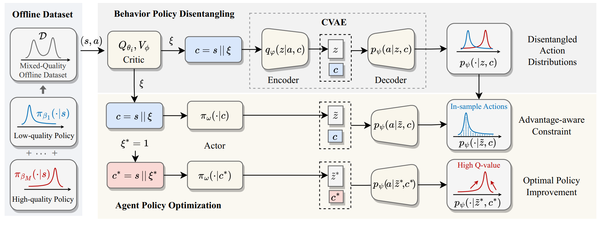

# A2PO: Towards Effective Offline Reinforcement Learning from an Advantage-aware Perspective

Official codebase for the paper [A2PO: Towards Effective Offline Reinforcement Learning from an Advantage-aware Perspective](https://arxiv.org/pdf/2403.07262).

## Overview



**TLDR: ** This paper presents Advantage-Aware Policy Optimization (A2PO), a novel method designed to improve offline reinforcement learning (RL) performance on datasets with varied quality. A2PO addresses the constraint conflicts common in mixed-quality offline datasets by implementing an advantage-aware policy that uses conditional variational autoencoders (CVAE) to disentangle diverse behavior policies. By conditioning on advantage values, A2PO selectively optimizes policies toward high-value actions, surpassing conventional advantage-weighted methods in benchmark evaluations. Experimental results demonstrate A2PO's superior effectiveness in achieving optimal policies across single- and mixed-quality datasets in comparison with existing offline RL baselines.

## Installation

Please execute the following command:

```bash
conda env create -f environment.yml
conda activate offrl
```

## Datasets

Our experiments are performed on [D4RL datasets](https://github.com/rail-berkeley/d4rl). Meanwhile, we have runed our experiments on more diverse datasets constructed on the original D4RL trajectories. These newly constructed datasets can be found at this [link](). 

## Running experiments

The paper results can be reproduced by :

```
python main.py --env=<env_name> --seed=<seed_id>
```

If want to see influence of different components, the command can be extent as bellow:

```
python main.py --env=<env_name> --use_discrete=<Bool> --epsilon=<epsilon> --vae_step=<vae step> --seed=<seed_id>
```

## Citation

If you find this work useful for your research, please cite our paper:

```
@article{qing2024advantage,
  title={Advantage-Aware Policy Optimization for Offline Reinforcement Learning},
  author={Qing, Yunpeng and Cong, Jingyuan and Chen, Kaixuan and Zhou, Yihe and Song, Mingli and others},
  journal={arXiv preprint arXiv:2403.07262},
  year={2024}
}
```

## Contact

Please feel free to contact me via email ([qingyunpeng@zju.edu.cn](mailto:qingyunpeng@zju.edu.cn), [liushunyu@zju.edu.cn](mailto:liushunyu@zju.edu.cn)) if you are interested in our research :)


=
